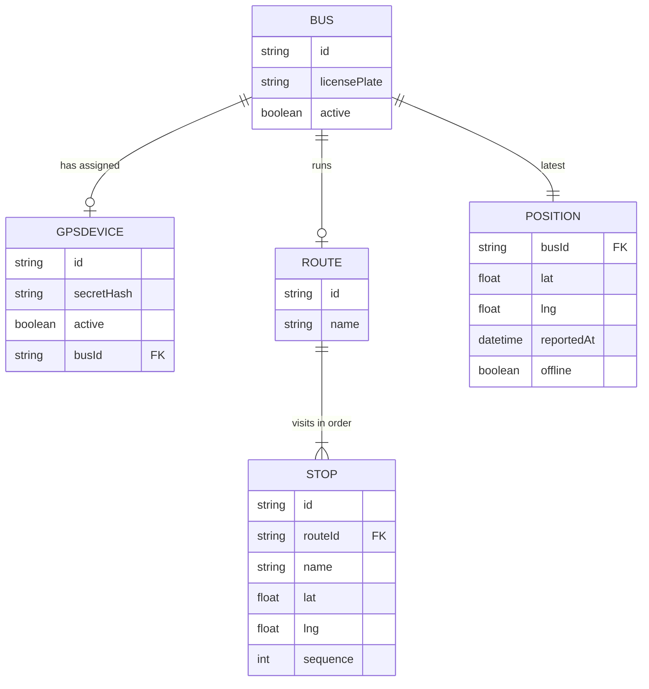

# Domain model

The fleet is the spine: a bus carries one reassignable GPS device and runs at
most one route at a time; a route is an ordered sequence of stops. Every
location update refreshes the bus's one current position.

- A `GPSDEVICE` is reassigned between buses; its `busId` changes, the device
row itself does not.
- A `BUS` can run only one `ROUTE` at a time; reassigning replaces the link.
- `POSITION` holds one row per bus — the latest report, not a history — with
`offline` computed from how long ago `reportedAt` was.