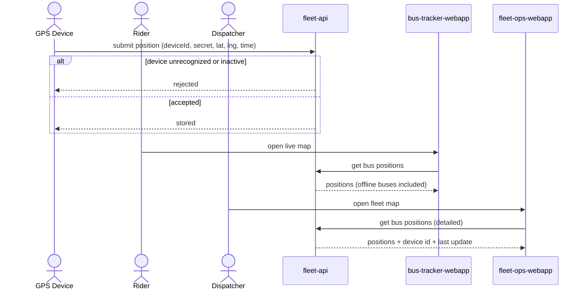

# Live location tracking

A GPS device reports a bus's position, and a rider and a dispatcher each see
it update on their own map.

```mermaid
sequenceDiagram
    actor GPSDevice as GPS Device
    actor Rider
    actor Dispatcher
    participant fleet-api
    participant bus-tracker-webapp
    participant fleet-ops-webapp

    GPSDevice->>fleet-api: submit position (deviceId, secret, lat, lng, time)
    alt device unrecognized or inactive
        fleet-api-->>GPSDevice: rejected
    else accepted
        fleet-api-->>GPSDevice: stored
    end

    Rider->>bus-tracker-webapp: open live map
    bus-tracker-webapp->>fleet-api: get bus positions
    fleet-api-->>bus-tracker-webapp: positions (offline buses included)

    Dispatcher->>fleet-ops-webapp: open fleet map
    fleet-ops-webapp->>fleet-api: get bus positions (detailed)
    fleet-api-->>fleet-ops-webapp: positions + device id + last update
```